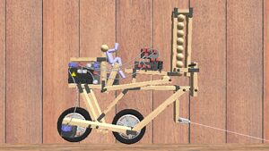
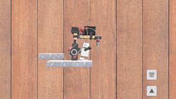
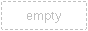
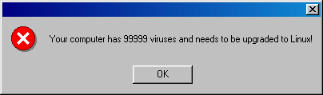

# ROllerozxa

I'm t3h RaCco0n of d00m! Hi I'm ROllerozxa and I am mostly a programmer, though I enjoy other things sometimes. This is my homepage on the Internet where I write about things that may be interesting.

	 <strong style="color:yellow">This site is still under construction!</strong> Check back later for when more content is added.

## Principia
Principia is a game I have taken over the maintenance of after it became freeware with source available. It is a physics-based building game with advanced electronics and great hyper-realistic graphics that makes you wonder if it is real life or not. Expect framerates that are around that of Starwing though, unless you have a beefy computer.

	
	
	

The game is available for PC (Windows and Linux) as well as an experimental port to cell phones. [Read more about it here](https://principia-web.se).

## More stuff

There is a [gallery page](./gallery.htm) with some photos.

## Contact

Want to talk to me? Catch me on IRC, if you're lucky, late in the evening.

Once you have given up on that, you can add me on XMPP. My handle is . XMPP is a bit like MSN but for cool nerds, I'm sure you will figure it out!

You can also email me at . Maybe I should get a better email address someday...

---

	
	
	
	
	
	
	
	
	
	
	
	
	

	

